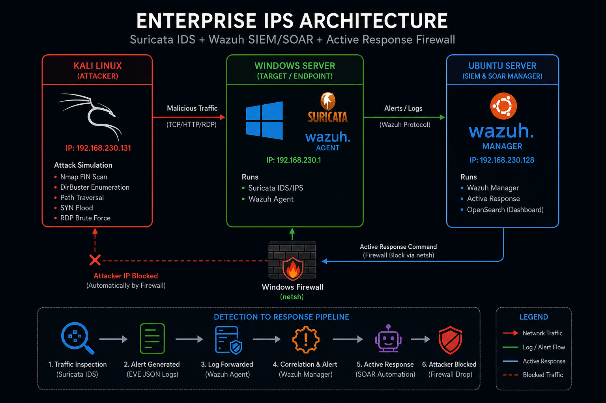
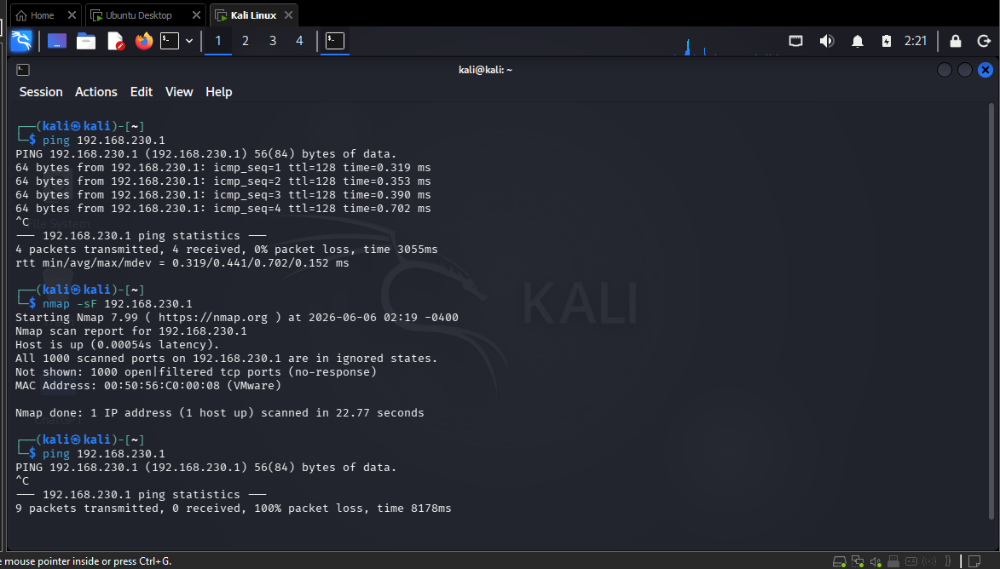
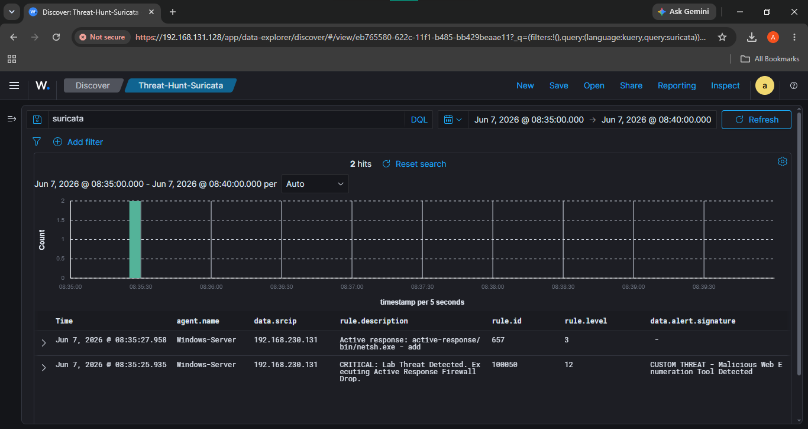
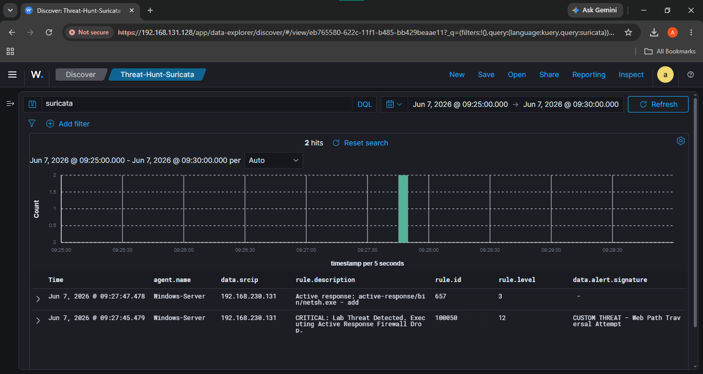
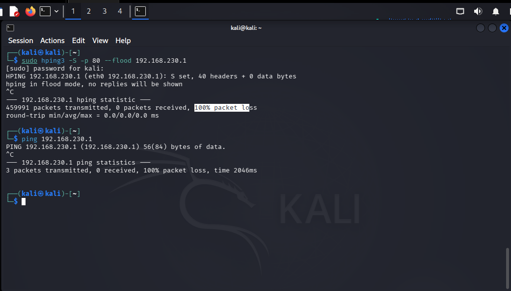
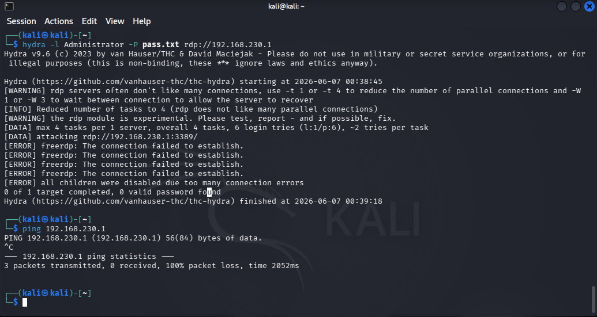
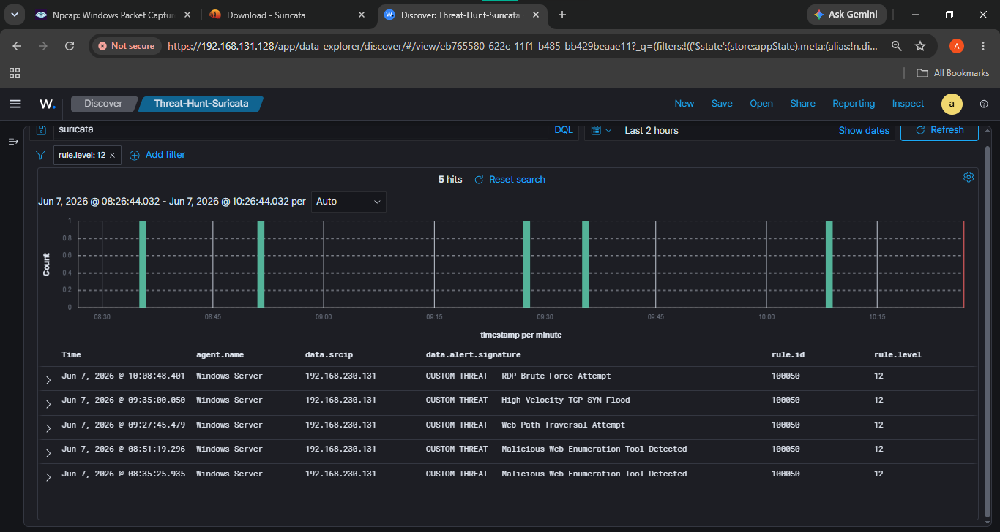

# Enterprise-Grade Intrusion Prevention System (IPS)

## Automated Threat Mitigation via Suricata and Wazuh SOAR Integration



---

## Overview

This project demonstrates the design, engineering, and deployment of a fully automated Intrusion Prevention System (IPS) using Suricata and Wazuh.

The solution combines:

* Deep Packet Inspection (DPI)
* Custom Detection Engineering
* SIEM Correlation
* Security Orchestration, Automation and Response (SOAR)
* Dynamic Firewall Blocking

Unlike traditional IDS deployments that require analyst intervention, this architecture automatically detects malicious activity, correlates security events, and executes firewall containment actions within seconds.

---

## Project Objectives

* Detect malicious network activity using Suricata
* Reduce alert fatigue through intelligent thresholding
* Correlate security events using Wazuh
* Automatically block attackers using Active Response
* Build a closed-loop IPS architecture
* Demonstrate enterprise-level detection engineering

---

# Architecture

## Infrastructure Topology

```text
                    ┌─────────────────────┐
                    │     Kali Linux      │
                    │   192.168.230.131   │
                    │     (Attacker)      │
                    └──────────┬──────────┘
                               │
                               ▼
                    ┌─────────────────────┐
                    │   Windows Server    │
                    │    192.168.230.1    │
                    │                     │
                    │  Suricata IDS/IPS   │
                    │   Wazuh Agent       │
                    └──────────┬──────────┘
                               │
                               ▼
                    ┌─────────────────────┐
                    │   Ubuntu Server     │
                    │    Wazuh Manager    │
                    │   Active Response   │
                    └─────────────────────┘
```

---

## Network Topology

> Add topology screenshot below


---

# Technology Stack

| Technology     | Purpose               |
| -------------- | --------------------- |
| Suricata       | Network IDS/IPS       |
| Wazuh          | SIEM & SOAR           |
| Windows Server | Protected Endpoint    |
| Ubuntu Server  | Wazuh Manager         |
| Kali Linux     | Attack Simulation     |
| OpenSearch     | Threat Hunting        |
| Netsh Firewall | Automated Containment |

---

# Detection Engineering

## Custom Suricata Rule Set

Location:

```text
C:\Program Files\Suricata\rules\custom.rules
```

The detection rules were engineered to identify:

* Stealth Reconnaissance
* Directory Enumeration
* Path Traversal
* SYN Flood Attacks
* RDP Brute Force Attempts

### Rule Categories

| SID     | Attack Type           |
| ------- | --------------------- |
| 1000006 | Nmap FIN Scan         |
| 1000007 | Directory Enumeration |
| 1000008 | Path Traversal        |
| 1000009 | TCP SYN Flood         |
| 1000010 | RDP Brute Force       |

---

# Wazuh Correlation Engine

## Master Trigger Rule

Location:

```text
/var/ossec/etc/rules/local_rules.xml
```

Instead of writing multiple SIEM correlation rules, a single master trigger rule was created.

This rule detects any Suricata event containing:

```text
CUSTOM THREAT
```

and automatically escalates the alert to Critical severity.

---

## Correlation Rule

```xml
<group name="suricata, custom_ips,">
  <rule id="100050" level="12">
    <if_sid>86601</if_sid>
    <match>CUSTOM THREAT</match>
    <description>
      CRITICAL: Lab Threat Detected. Executing Active Response Firewall Drop.
    </description>
  </rule>
</group>
```

---

# Active Response Automation

## Firewall Containment

When Rule 100050 triggers:

1. Source IP extracted
2. Attacker identified
3. Windows firewall updated
4. Attacker blocked automatically

---

## Active Response Configuration

Location:

```text
/var/ossec/etc/ossec.conf
```

```xml
<active-response>
  <command>netsh</command>
  <location>local</location>
  <rules_id>100050</rules_id>
  <timeout>300</timeout>
</active-response>
```

---

# Custom JSON Decoder Engineering

During implementation, Wazuh Active Response could not properly extract the attacker IP address.

A custom decoder was developed to map:

```text
src_ip
```

to:

```text
srcip
```

required by the Active Response engine.

---

## Decoder Configuration

Location:

```text
/var/ossec/etc/decoders/local_decoder.xml
```

```xml
<decoder name="json-child">
  <parent>json</parent>
  <plugin_decoder>JSON_Decoder</plugin_decoder>
</decoder>

<decoder name="json-child">
  <parent>json</parent>
  <regex type="pcre2">"src_ip":"([^"]+)"</regex>
  <order>srcip</order>
</decoder>
```

---

# Attack Simulation & Validation

To validate the IPS, multiple attack vectors were launched from Kali Linux.

A continuous ICMP ping was maintained throughout testing to verify exactly when firewall containment occurred.

---

# Attack Scenario 1

## Stealth Reconnaissance (Nmap FIN Scan)

### Command

```bash
sudo nmap -sF 192.168.230.1
```

### Result

* Suricata Alert Generated
* Wazuh Correlation Triggered
* Firewall Rule Applied
* Attacker Isolated

### Screenshot



---

# Attack Scenario 2

## Directory Enumeration

### Command

```bash
curl -A "DirBuster" http://192.168.230.1/
```

### Result

* User-Agent Inspection Triggered
* Enumeration Detected
* Attacker Blocked

### Screenshot



---

# Attack Scenario 3

## Path Traversal

### Command

```bash
curl --path-as-is "http://192.168.230.1/../../etc/passwd"
```

### Result

* Raw URI Inspection Triggered
* Exploitation Attempt Detected
* Attacker Blocked

### Screenshot



---

# Attack Scenario 4

## TCP SYN Flood

### Command

```bash
sudo hping3 -S -p 80 --flood 192.168.230.1
```

### Result

* Threshold Exceeded
* Single Alert Generated
* Flood Mitigated

### Screenshot



---

# Attack Scenario 5

## RDP Brute Force

### Command

```bash
hydra -l Administrator -P pass.txt rdp://192.168.230.1
```

### Result

* 5 Failed Attempts Detected
* Active Response Triggered
* Connection Terminated

### Screenshot



---

# Threat Hunting Dashboard

A dedicated OpenSearch visualization was built for threat hunting and executive reporting.

---

## Threat Hunting Query

```text
rule.level >= 10 AND
(rule.groups: "suricata" OR rule.groups: "active_response")
```

---

## Dashboard Screenshot



---

# Engineering Challenges & Solutions

## Challenge 1 — Alert Fatigue

### Problem

Nmap scans generated thousands of alerts.

### Solution

Implemented:

* Threshold Type Limit
* Threshold Type Both
* 60-second cooldown windows

---

## Challenge 2 — JSON Parsing Failure

### Problem

Active Response failed to identify attacker IP.

### Solution

Developed custom PCRE2 decoder.

---

## Challenge 3 — HTTP Payload Visibility

### Problem

No HTTP inspection because server wasn't listening.

### Solution

Hosted temporary Python HTTP server.

```bash
python -m http.server 80
```

---

## Challenge 4 — Path Traversal Normalization

### Problem

Payload automatically sanitized.

### Solution

Used:

```bash
curl --path-as-is
```

and switched Suricata inspection to:

```text
http_raw_uri
```

---

# Skills Demonstrated

* Detection Engineering
* SIEM Engineering
* SOAR Automation
* Threat Hunting
* Incident Response
* Active Response Development
* Network Security
* Intrusion Detection
* Intrusion Prevention
* Suricata Rule Writing
* Wazuh Administration
* Firewall Automation
* Blue Team Operations

---
