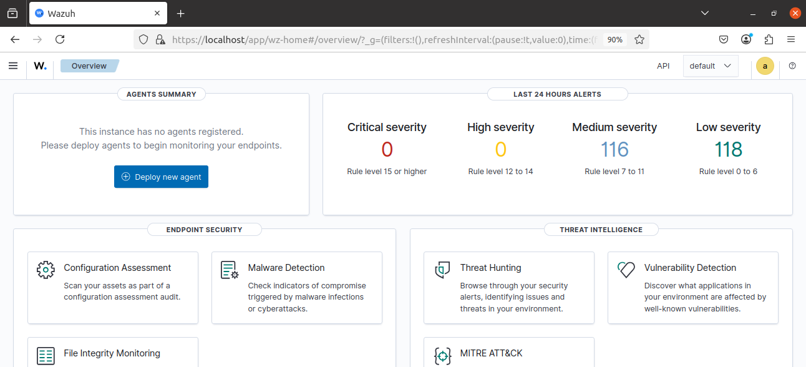
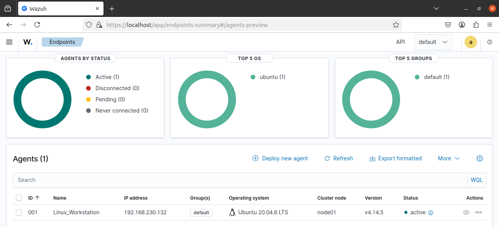
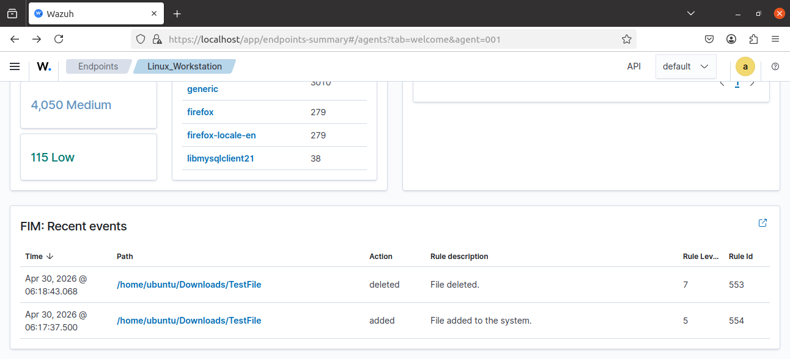
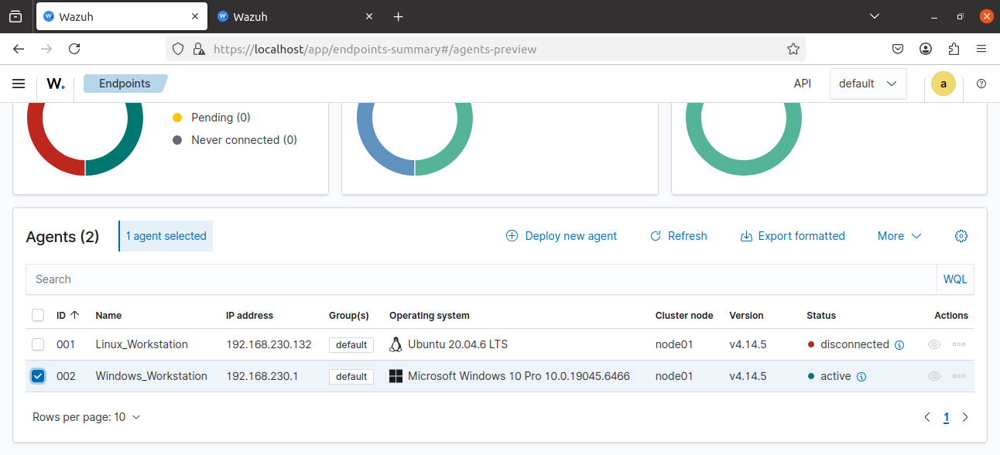
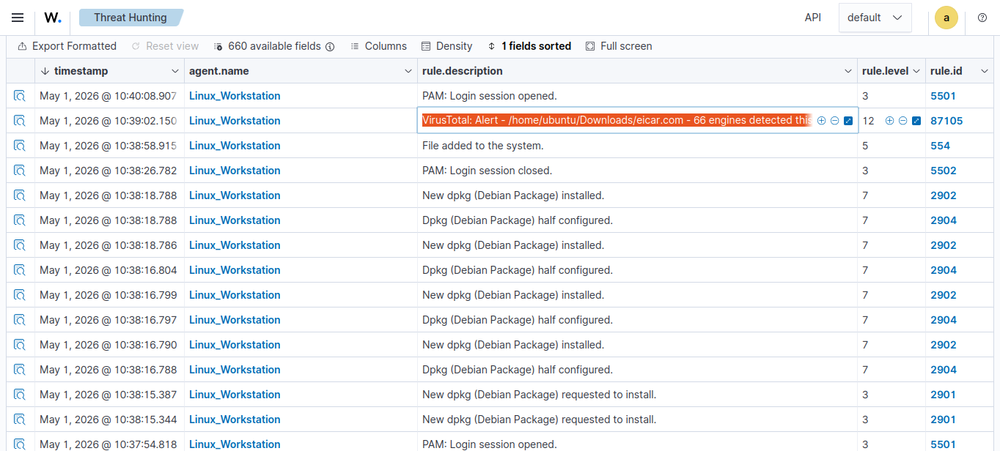
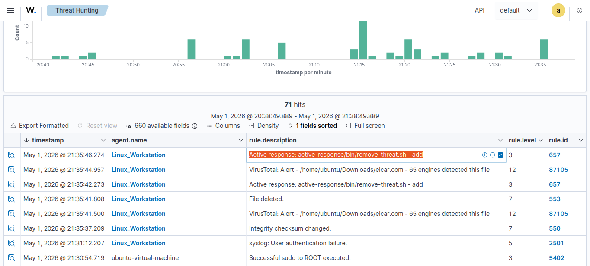

# Wazuh + VirusTotal Integration and Active Response

## Overview

This project demonstrates the integration of the Wazuh SIEM/XDR platform with VirusTotal to enhance threat detection, malware analysis, and automated remediation inside a SOC (Security Operations Center) environment.

The lab simulates a real-world blue team workflow where suspicious files detected through File Integrity Monitoring (FIM) are automatically analyzed using VirusTotal threat intelligence.

The project includes:

- Wazuh Manager installation on Ubuntu
- Linux and Windows agent deployment
- Real-time File Integrity Monitoring (FIM)
- VirusTotal API integration
- Malware simulation using the EICAR test file
- Automated remediation using Wazuh Active Response

---

# Technologies Used

| Technology | Purpose |
|---|---|
| Wazuh | SIEM/XDR Platform |
| VirusTotal API | Threat Intelligence |
| Ubuntu Server | Wazuh Manager |
| Ubuntu Agent | Linux Endpoint |
| Windows 10/11 | Windows Endpoint |
| Bash Scripting | Automation |
| jq | JSON Parsing |
| EICAR Test File | Malware Simulation |

---

# Lab Environment

| Component | Description |
|---|---|
| Wazuh Manager | Central monitoring server |
| Linux Agent | Ubuntu endpoint monitoring |
| Windows Agent | Windows endpoint monitoring |
| VirusTotal | File reputation analysis |

---

# Repository Structure

```text
wazuh-virustotal-soc-lab/
│
├── README.md
├── LICENSE
├── .gitignore
│
├── images/
│   ├── wazuh-dashboard-overview.png
│   ├── linux-agent-connected.png
│   ├── windows-agent-connected.png
│   ├── fim-alert-linux.png
│   ├── fim-alert-windows.png
│   ├── malware-detection.png
│   └── active-response-success.png
│
├── configs/
│   ├── manager-ossec.conf
│   ├── linux-agent-ossec.conf
│   └── windows-agent-ossec.conf
│
├── scripts/
│   ├── remove-threat.sh
│   ├── install-jq.sh
│   ├── eicar-test.sh
│   └── restart-services.sh
│
├── docs/
│   ├── deployment-notes.md
│   └── troubleshooting.md
│
└── logs/
    └── sample-alerts.json
````

---

# Installing Wazuh Manager

## Prerequisites

* Ubuntu 22.04 or 24.04
* Minimum 4 GB RAM
* 2 CPU cores
* Internet connection

---

## Update System

```bash
sudo apt update && sudo apt upgrade -y
sudo apt install curl gnupg apt-transport-https unzip -y
```

---

## Configure Firewall

```bash
sudo ufw allow 1514/tcp
sudo ufw allow 1515/tcp
sudo ufw allow 443/tcp
sudo ufw enable
```

---

## Download and Install Wazuh

```bash
curl -sO https://packages.wazuh.com/4.7/wazuh-install.sh
sudo bash ./wazuh-install.sh -a
```

---

## Access Dashboard

Open browser:

```text
https://YOUR_WAZUH_SERVER_IP
```

---

# Wazuh Dashboard



---

# Linux Agent Deployment

## Deploy Linux Agent

Navigate to:

```text
Agents Management → Deploy New Agent
```

Select:

* Linux
* DEB amd64

Copy the generated command.

---

## Install Agent

Example:

```bash
wget https://packages.wazuh.com/4.x/apt/pool/main/w/wazuh-agent/wazuh-agent_4.x.x-1_amd64.deb

sudo WAZUH_MANAGER='MANAGER_IP' dpkg -i wazuh-agent_4.x.x-1_amd64.deb
```

---

## Start Agent

```bash
sudo systemctl daemon-reload
sudo systemctl enable wazuh-agent
sudo systemctl start wazuh-agent
```

---

# Linux Agent Connected



---

# Real-Time File Integrity Monitoring (FIM)

## Configure Linux FIM

Edit configuration:

```bash
sudo nano /var/ossec/etc/ossec.conf
```

Add inside `<syscheck>`:

```xml
<directories realtime="yes" check_all="yes">/home/ubuntu/Downloads</directories>
```

---

## Restart Agent

```bash
sudo systemctl restart wazuh-agent
```

---

## Test Monitoring

```bash
touch /home/ubuntu/Downloads/testfile.txt

rm -f /home/ubuntu/Downloads/testfile.txt
```

---

# Linux FIM Alert



---

# Windows Agent Deployment

## Deploy Windows Agent

Navigate to:

```text
Agents Management → Deploy New Agent
```

Select:

* Windows
* MSI Installer

Copy generated PowerShell command.

---

## Install Windows Agent

Run PowerShell as Administrator:

```powershell
Invoke-WebRequest -Uri https://packages.wazuh.com/4.x/windows/wazuh-agent-4.x.x.msi -OutFile wazuh-agent.msi

msiexec.exe /i wazuh-agent.msi /q WAZUH_MANAGER='MANAGER_IP'
```

---

## Configure Windows FIM

Edit:

```text
C:\Program Files (x86)\ossec-agent\ossec.conf
```

Add:

```xml
<directories realtime="yes" check_all="yes">C:\Users\</directories>
```

---

## Restart Windows Agent

```powershell
Restart-Service -Name wazuh
```

---

# Windows Agent Connected



---

# VirusTotal Integration

## Create VirusTotal Account

Create free account:

https://www.virustotal.com

Copy your API key.

---

## Configure VirusTotal Integration

Edit manager configuration:

```bash
sudo nano /var/ossec/etc/ossec.conf
```

Add:

```xml
<integration>
  <name>virustotal</name>
  <api_key>YOUR_API_KEY</api_key>
  <group>syscheck</group>
  <alert_format>json</alert_format>
</integration>
```

---

## Restart Wazuh Manager

```bash
sudo systemctl restart wazuh-manager
```

---

# VirusTotal Detection Workflow

1. File added to monitored directory
2. Wazuh Agent calculates hash
3. Wazuh Manager queries VirusTotal
4. VirusTotal returns reputation
5. Wazuh creates alert

---

# Malware Simulation using EICAR

## Download EICAR Test File

```bash
cd /home/ubuntu/Downloads

curl -sO (https://secure.eicar.org/eicar.com)
```

---

## Expected Result

* Wazuh detects file creation
* VirusTotal flags file as malicious
* High-severity alert appears

---

# Malware Detection Alert



---

# Automated Remediation

## Install jq

```bash
sudo apt update

sudo apt install jq -y
```

---

## Create Active Response Script

Path:

```text
/var/ossec/active-response/bin/remove-threat.sh
```

---

## remove-threat.sh

```bash
#!/bin/bash

LOCAL=`dirname $0`;
cd $LOCAL
cd ../
PWD=`pwd`

read INPUT_JSON

FILENAME=$(echo $INPUT_JSON | jq -r .parameters.alert.data.virustotal.source.file)
COMMAND=$(echo $INPUT_JSON | jq -r .command)

LOG_FILE="${PWD}/../logs/active-responses.log"

if [ ${COMMAND} = "add" ]
then
    printf '{"version":1,"origin":{"name":"remove-threat","module":"active-response"},"command":"check_keys", "parameters":{"keys":[]}}\n'

    read RESPONSE

    COMMAND2=$(echo $RESPONSE | jq -r .command)

    if [ ${COMMAND2} != "continue" ]
    then
        echo "`date '+%Y/%m/%d %H:%M:%S'` $0: $INPUT_JSON Remove threat active response aborted" >> ${LOG_FILE}
        exit 0;
    fi
fi

rm -f $FILENAME

if [ $? -eq 0 ]; then
    echo "`date '+%Y/%m/%d %H:%M:%S'` $0: $INPUT_JSON Successfully removed threat" >> ${LOG_FILE}
else
    echo "`date '+%Y/%m/%d %H:%M:%S'` $0: $INPUT_JSON Error removing threat" >> ${LOG_FILE}
fi

exit 0;
```

---

## Set Permissions

```bash
sudo chmod 750 /var/ossec/active-response/bin/remove-threat.sh

sudo chown root:wazuh /var/ossec/active-response/bin/remove-threat.sh
```

---

## Configure Active Response

Add to `ossec.conf`:

```xml
<command>
  <name>remove-threat</name>
  <executable>remove-threat.sh</executable>
  <timeout_allowed>no</timeout_allowed>
</command>

<active-response>
  <command>remove-threat</command>
  <location>local</location>
  <rules_id>87105</rules_id>
</active-response>
```

---

## Restart Services

```bash
sudo systemctl restart wazuh-manager

sudo systemctl restart wazuh-agent
```

---

# Active Response Success


---

# Troubleshooting

## Agent Not Connecting

Check service:

```bash
sudo systemctl status wazuh-agent
```

---

## VirusTotal Alerts Missing

Verify:

* API key is correct
* Internet access available
* Wazuh Manager restarted

---

## Active Response Not Working

Check logs:

```bash
sudo cat /var/ossec/logs/active-responses.log
```

---

# Learning Outcomes

This project demonstrates:

* SIEM deployment
* Threat intelligence integration
* Endpoint monitoring
* File Integrity Monitoring
* Malware detection
* Automated remediation
* SOC operations
* Security automation scripting

---

