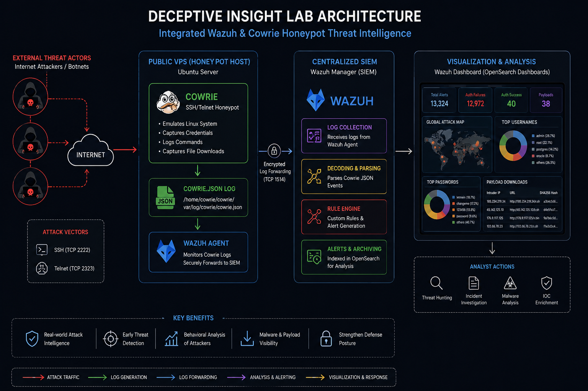
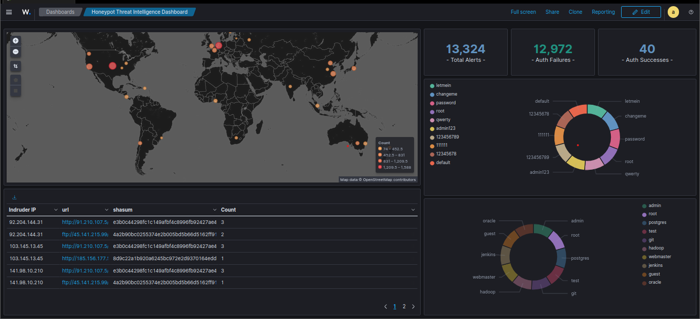

# Cowrie Honeypot - Threat Intel Lab

## Overview
This is a threat intelligence and deception engineering project that integrates the **Cowrie SSH/Tlnet honeypot**e with the **Wazuh SIEM** platform for centralized detection, alerting, visualization, and threat hunting.

The project captures:
- Brute-force login attempts
- Credential spraying
- Command execution behavior
- Malware payload downloads
- Intruder IP intelligence
- Geographic attack origins

This repository documents the complete setup, deployment, integration, and dashboard engineering process.

---

# Architecture

```text
                    INTERNET
                        |
         Automated Scanners / Botnets
                        |
                 ┌─────────────┐
                 │ Cowrie VPS  │
                 │ Honeypot    │
                 └──────┬──────┘
                        |
                 JSON Log Forwarding
                        |
                 ┌─────────────┐
                 │ Wazuh Agent │
                 └──────┬──────┘
                        |
                 ┌─────────────┐
                 │ Wazuh SIEM  │
                 │ OpenSearch  │
                 └──────┬──────┘
                        |
                 Threat Hunting
                  Dashboards
                  GeoIP Maps
```

---

# Screenshots

## Architecture Diagram





---

## Wazuh Dashboard





---

# Lab Environment

| Component | Technology |
|---|---|
| SIEM | Wazuh |
| Search Engine | OpenSearch |
| Honeypot | Cowrie |
| OS | Ubuntu Server |
| Deployment | VPS + Local VM |
| Log Format | JSON |
| Monitoring | Wazuh Agent |

---

# Project Objectives

- Build an active deception environment
- Capture real-world attack telemetry
- Analyze brute-force campaigns
- Detect post-exploitation behavior
- Visualize attack trends in Wazuh dashboards
- Generate actionable threat intelligence

---

# Cowrie Honeypot Deployment

## 1. Install Dependencies

```bash
sudo apt update
sudo apt install git python3-virtualenv libssl-dev libffi-dev build-essential authbind -y
```

---

## 2. Create Dedicated User

```bash
sudo adduser --disabled-password cowrie
sudo su cowrie
```

---

## 3. Clone Cowrie

```bash
git clone https://github.com/cowrie/cowrie.git ~/cowrie
cd ~/cowrie
```

---

## 4. Create Virtual Environment

```bash
python3 -m venv cowrie-env
source cowrie-env/bin/activate
```

---

## 5. Install Requirements

```bash
pip install --upgrade pip
pip install -r requirements.txt
```

---

## 6. Configure Cowrie

```bash
cp etc/cowrie.cfg.dist etc/cowrie.cfg
```

---

## 7. Start Cowrie

```bash
bin/cowrie start
```

---

## 8. Verify Listener

```bash
sudo netstat -tulpn | grep :2222
```

---

## 9. Test SSH Interaction

```bash
ssh -p 2222 root@localhost
```

---

# Wazuh Integration

## Configure ossec.conf

File:
```text
/var/ossec/etc/ossec.conf
```

Add:

```xml
<localfile>
  <log_format>json</log_format>
  <location>/home/cowrie/cowrie/var/log/cowrie/cowrie.json</location>
</localfile>
```

Restart Wazuh Agent:

```bash
sudo systemctl restart wazuh-agent
```

---

# Custom Wazuh Rules

Location:
```text
/var/ossec/etc/rules/local_rules.xml
```

Copy the rules from:
```text
wazuh-rules/local_rules.xml
```

Restart manager:

```bash
sudo systemctl restart wazuh-manager
```

---

# Part 4 — Dashboard Engineering

## Create Index Pattern

1. Open Wazuh Dashboard
2. Navigate to:
   - Stack Management
   - Index Patterns
3. Create:
   ```text
   wazuh-alerts-*
   ```

---

## Create Global Attack Map

### Requirements
Enable GeoIP enrichment in Wazuh/OpenSearch.

### Visualization Steps
1. Go to:
   - Visualize Library
   - Create Visualization
2. Select:
   - Maps
3. Configure:
   - Source field: `data.srcip`
   - Geo field: `GeoIP.location`
4. Save visualization as:
   ```text
   Global Attack Map
   ```

---

## Create Authentication Failure Counter

### Visualization Type
Metric

### Query
```text
rule.id:100002
```

### Metric
Count

Save as:
```text
Authentication Failures
```

---

## Create Authentication Success Counter

### Query
```text
rule.id:100003
```

Save as:
```text
Authentication Successes
```

---

## Create Username Donut Chart

### Visualization
Pie / Donut

### Bucket
Terms Aggregation

### Field
```text
data.username.keyword
```

---

## Create Password Donut Chart

### Field
```text
data.password.keyword
```

---

## Create Malware Download Table

### Visualization
Data Table

### Columns
- data.src_ip
- data.url
- data.shasum

### Query
```text
rule.id:100005
```

---

# VPS Internet Exposure

## VPS Setup

Recommended providers:
- DigitalOcean
- Vultr
- Linode
- AWS Lightsail

---

## Open Required Ports

```bash
sudo ufw allow 22
sudo ufw allow 2222
sudo ufw allow 23
```

---

## Secure Log Forwarding

Install Wazuh Agent on VPS and point it to your central manager.

Example:
```bash
sudo nano /var/ossec/etc/ossec.conf
```

Configure manager IP.

---

# Threat Hunting Examples

## Find Top Attacking IPs

```kql
rule.groups : "cowrie"
```

---

## Find Downloaded Payloads

```kql
rule.id : 100005
```

---

## Find Successful Logins

```kql
rule.id : 100003
```

---

# Repository Structure

```text
deceptive-insight/
│
├── README.md
├── scripts/
│   ├── install_cowrie.sh
│   └── start_cowrie.sh
│
├── wazuh-rules/
│   └── local_rules.xml
│
├── dashboard-guide/
│   └── dashboard-notes.md
│
└── images/
    ├── dashboard.png
    ├── architecture.png
    └── setup
       ├── cowrie-start.png
       └── netstat.png
```

---

# References

- https://github.com/cowrie/cowrie
- https://documentation.wazuh.com/
- https://opensearch.org/

---


